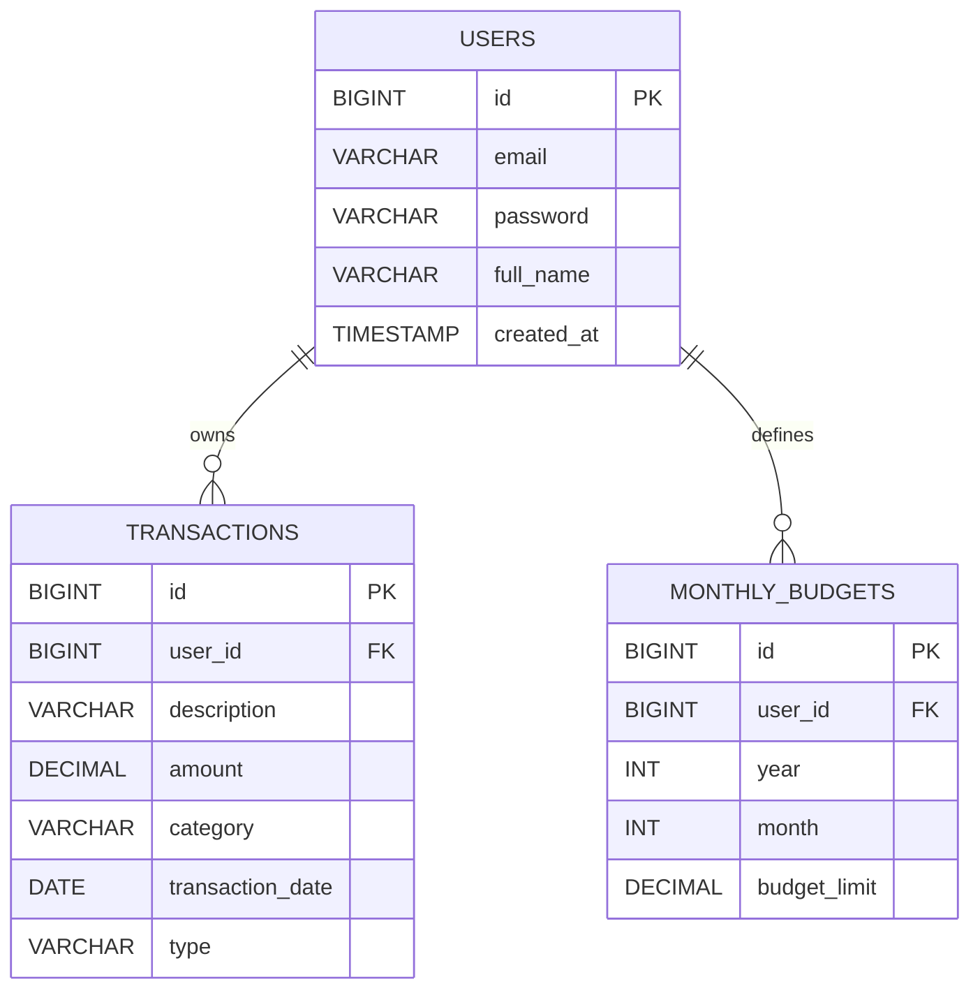

# Documentación Backend - AppFinanzas

Fecha: 2026-06-03

Documento de referencia del backend real del proyecto. Resume Swagger/OpenAPI, arquitectura hexagonal, endpoints, Docker y pruebas.

---

## 1. Swagger / OpenAPI

### Estado real

- Dependencia activa en `pom.xml`: `springdoc-openapi-starter-webmvc-ui` `2.8.5`.
- Ruta de OpenAPI: `http://localhost:8081/api-docs`.
- Swagger UI: `http://localhost:8081/swagger-ui.html` o `http://localhost:8081/swagger-ui/index.html`.
- Health y metadatos del backend disponibles en Actuator: `http://localhost:8081/actuator/health` y `http://localhost:8081/actuator/info`.

### Anotaciones recomendadas

- `@Tag`
- `@Operation`
- `@ApiResponses`
- `@Schema`

### Ejemplo

```java
@RestController
@RequestMapping("/auth")
@Tag(name = "Auth", description = "Registro, inicio y cierre de sesión")
public class AuthController {

    @Operation(summary = "Iniciar sesión")
    @ApiResponses({
        @ApiResponse(responseCode = "200", description = "OK"),
        @ApiResponse(responseCode = "400", description = "Datos inválidos")
    })
    @PostMapping("/login")
    public ResponseEntity<ApiResponse> login(@Valid @RequestBody LoginUserDTO dto) { ... }
}
```

### Ejemplos JSON

**Registro**

```json
{
  "email": "usuario@test.com",
  "password": "Test1234!",
  "name": "Usuario Test"
}
```

**Login**

```json
{
  "email": "usuario@test.com",
  "password": "Test1234!"
}
```

**Respuesta de login**

```json
{
  "message": "Inicio de sesión exitoso",
  "success": true,
  "data": {
    "token": "eyJhbGciOiJIUzI1NiJ9...",
    "id": 1,
    "email": "usuario@test.com",
    "name": "Usuario Test"
  }
}
```

**Crear transacción**

```json
{
  "description": "Almuerzo en restaurante",
  "amount": 25.5,
  "category": "ALIMENTACION",
  "date": "2026-06-03",
  "type": "GASTO",
  "userId": 1
}
```

**Historial / listado**

```json
[
  {
    "id": 10,
    "description": "Almuerzo en restaurante",
    "amount": 25.5,
    "category": "ALIMENTACION",
    "date": "2026-06-03",
    "type": "GASTO",
    "userId": null
  }
]
```

### Buenas prácticas REST

- Documentar request/response con DTOs reales.
- Indicar códigos HTTP reales.
- Marcar explícitamente cualquier endpoint pendiente.

---

## 2. README organizado

### Descripción del proyecto

`AppFinanzas` es un backend para gestión de finanzas personales. Permite registrar usuarios, iniciar sesión con JWT, cerrar sesión, crear ingresos y gastos, consultar historial, definir y consultar el presupuesto mensual y visualizar un dashboard resumido por usuario.

### Tecnologías utilizadas

- Spring Boot 3.5.13
- Java 17
- PostgreSQL
- Maven
- Docker / docker-compose
- springdoc-openapi
- JPA / Hibernate
- Bean Validation
- JWT (`jjwt`)

### Arquitectura hexagonal

- **Domain**: `domain.model` con `User`, `Transaction`, `Income`, `Expense`, `Budget`, `MonthlyBudget`, enums y categorías.
- **Domain strategy**: `domain.strategy` con `TransactionStrategy`, `IncomeStrategy` y `ExpenseStrategy`.
- **Application**: `application.usecase` con casos de uso de registro, autenticación, transacciones, presupuesto y dashboard.
- **Ports**: `domain.port.out` con interfaces de persistencia.
- **Adapters / Infrastructure**: `infrastructure.adapter.in.web` y `infrastructure.adapter.out.persistance`.
- **Service**: `application.service.JwtService` para emisión e invalidación de tokens.

### Estructura real

- `domain/model` -> entidades, enums y modelos de presupuesto.
- `domain/strategy` -> estrategia de procesado de ingresos y gastos.
- `domain/port/out` -> puertos de persistencia para usuarios, transacciones y presupuesto.
- `application/usecase` -> lógica de negocio.
- `application/service` -> servicios auxiliares como JWT.
- `infrastructure/adapter/in/web` -> controladores REST, DTOs y `ApiResponse`.
- `infrastructure/adapter/out/persistance` -> JPA, entidades y repositorios.
- `config` -> CORS, Jackson y propiedades de presupuesto.

### Instalación y ejecución

```bash
git clone https://github.com/UberRz/personalFinanceApp
cd personalFinanceApp/backend
mvn clean package
mvn spring-boot:run
```

La API escucha en `http://localhost:8081`.

### Variables de entorno relevantes

- `SPRING_DATASOURCE_URL`
- `SPRING_DATASOURCE_USERNAME`
- `SPRING_DATASOURCE_PASSWORD`
- `SERVER_PORT`
- `app.default-budget`
- `springdoc.api-docs.path`
- `springdoc.swagger-ui.path`

### Swagger

- UI: `http://localhost:8081/swagger-ui.html`
- API docs: `http://localhost:8081/api-docs`

### Testing

```bash
cd backend
mvn test
```

### Endpoints principales

| Método | Ruta                             | Descripción                                   |
| ---    | ---                              | ---                                           |
| POST   | `/auth/register`                 | Registrar usuario                             |
| POST   | `/auth/login`                    | Iniciar sesión                                |
| POST   | `/auth/logout`                   | Cerrar sesión e invalidar token               |
| POST   | `/transactions`                  | Crear ingreso o gasto                         |
| GET    | `/transactions/user/{userId}`    | Listar transacciones del usuario              |
| GET    | `/transactions/history/{userId}` | Filtrar historial por tipo y fechas           |
| DELETE | `/transactions/{id}`             | Eliminar transacción                          |
| GET    | `/transactions/budget-status/{userId}` | Ver estado del presupuesto mensual      |
| GET    | `/transactions/budget/{userId}`   | Consultar presupuesto mensual actual         |
| POST   | `/transactions/budget`           | Crear o actualizar presupuesto mensual        |
| PUT    | `/transactions/budget`           | Crear o actualizar presupuesto mensual        |
| GET    | `/dashboard/{userId}`            | Consultar resumen del dashboard de un usuario |
| GET    | `/dashboard/me`                  | Consultar el dashboard del usuario autenticado|

### Troubleshooting

- CORS: revisar `CorsConfiguration`.
- DB: revisar `SPRING_DATASOURCE_URL`, usuario y contraseña.
- Login falla: revisar email y contraseña enviados al endpoint.
- Logout falla: revisar el header `Authorization: Bearer <token>`.
- Presupuesto no coincide: revisar `app.default-budget` y el presupuesto guardado para el mes actual.
- Puerto ocupado: cambiar `SERVER_PORT` o liberar el puerto.

---

## 3. Diagramas y arquitectura hexagonal

### Idea general

La arquitectura hexagonal separa la lógica de negocio de los detalles técnicos. En este proyecto, el dominio no depende de Spring y los controladores y repositorios actúan como adaptadores.

### Flujo de petición

1. El cliente llama a un controlador REST.
2. El controlador convierte el payload a DTO o modelo de dominio.
3. El caso de uso aplica las reglas de negocio.
4. El puerto de salida persiste o consulta datos.
5. El adaptador JPA usa PostgreSQL.

### Mapa breve de capas

- `AuthController`, `UserRegisterController` y `DashboardController` -> entrada HTTP.
- `TransactionController` y `BudgetController` -> entrada HTTP de transacciones, historial y presupuesto.
- `RegisterUserUseCase`, `AuthenticateUserUseCase`, `RegisterTransactionUseCase`, `GetTransactionsUseCase`, `GetFilteredTransactionsUseCase`, `DeleteTransactionUseCase`, `DefineBudgetUseCase`, `GetCurrentBudgetUseCase`, `GetBudgetStatusUseCase`, `GetDashboardSummaryUseCase` -> aplicación.
- `UserRepository`, `TransactionRepository`, `BudgetRepository` -> puertos.
- `UserRepositoryImpl`, `TransactionRepositoryImpl`, `BudgetRepositoryImpl` -> persistencia.

### ER básico



---

## 4. Documentación de endpoints

### Formato de respuesta usado por el backend

El backend responde con `ApiResponse` en registro, login, logout, creación y eliminación:

```json
{
  "message": "Las credenciales son incorrectas",
  "success": false,
  "data": null
}
```

### `POST /auth/register`

- **Descripción:** registra un usuario.
- **Headers:** `Content-Type: application/json`
- **Body:** `RegisterUserDTO`.
- **Response 201:**

```json
{
  "message": "Usuario registrado exitosamente",
  "success": true,
  "data": null
}
```

- **Errores reales:** email inválido, datos vacíos, email ya registrado.
- **Autenticación:** no requerida.

### `POST /auth/login`

- **Descripción:** autentica usuario y devuelve JWT.
- **Headers:** `Content-Type: application/json`
- **Body:** `LoginUserDTO`.
- **Response 200:**

```json
{
  "message": "Inicio de sesión exitoso",
  "success": true,
  "data": {
    "token": "eyJhbGciOiJIUzI1NiJ9...",
    "id": 1,
    "email": "usuario@test.com",
    "name": "Usuario Test"
  }
}
```

- **Errores reales:** email inválido o credenciales incorrectas.
- **Autenticación:** no requerida.

### `POST /auth/logout`

- **Descripción:** invalida el token recibido.
- **Headers:** `Authorization: Bearer <token>`.
- **Response 200:**

```json
{
  "message": "Sesión cerrada exitosamente",
  "success": true,
  "data": null
}
```

- **Errores reales:** token no proporcionado o cabecera mal formada.
- **Autenticación:** requiere token en el header `Authorization`.

### `POST /transactions`

- **Descripción:** crea una transacción asociada a `userId`.
- **Headers:** `Content-Type: application/json`
- **Body:** `TransactionDTO`.
- **Response 201:** objeto `Income` o `Expense` serializado dentro de `ApiResponse.data`.

```json
{
  "message": "Gasto registrado",
  "success": true,
  "data": {
    "id": null,
    "description": "Almuerzo en restaurante",
    "amount": 25.5,
    "date": "2026-06-03",
    "type": "GASTO",
    "categoryName": "ALIMENTACION"
  }
}
```

- **Validaciones reales:** `amount > 0`; `type` decide `Income` o `Expense`; `category` debe existir en el enum.
- **Autenticación:** no requerida, aunque el backend acepta `X-User-Id` para validar que el usuario coincida cuando se envía.

### `GET /transactions/user/{userId}`

- **Descripción:** devuelve todas las transacciones del usuario.
- **Headers:** ninguno adicional.
- **Response 200:** lista de `TransactionDTO`.
- **Autenticación:** no requerida, aunque el backend acepta `X-User-Id` para validar coincidencia cuando se envía.

### `GET /transactions/history/{userId}`

- **Descripción:** devuelve historial filtrado.
- **Query params reales:** `type`, `startDate`, `endDate`.
- **Autenticación:** no requerida, aunque el backend acepta `X-User-Id` para validar coincidencia cuando se envía.

### `DELETE /transactions/{id}`

- **Descripción:** elimina una transacción.
- **Headers:** `X-User-Id` opcional para controlar propiedad.
- **Response 200:**

```json
{
  "message": "Eliminado correctamente",
  "success": true,
  "data": null
}
```

- **Autenticación:** no requerida.

### `GET /transactions/budget-status/{userId}`

- **Descripción:** devuelve el estado del presupuesto del mes actual.
- **Headers:** `X-User-Id` opcional para controlar propiedad.
- **Response 200:** `BudgetStatusDTO` con presupuesto, ingresos, gasto, restante, porcentaje usado, año y mes.
- **Autenticación:** no requerida.

### `GET /transactions/budget/{userId}`

- **Descripción:** devuelve el presupuesto mensual actual.
- **Headers:** `X-User-Id` opcional para controlar propiedad.
- **Response 200:** `BudgetDTO` con límite, año y mes.
- **Autenticación:** no requerida.

### `POST /transactions/budget` y `PUT /transactions/budget`

- **Descripción:** crean o actualizan el presupuesto mensual del usuario para el mes actual.
- **Headers:** `X-User-Id` opcional y `Content-Type: application/json`.
- **Body:** `BudgetRequestDTO`.
- **Response 200:**

```json
{
  "message": "Presupuesto guardado correctamente",
  "success": true,
  "data": {
    "limit": 1500,
    "year": 2026,
    "month": 6
  }
}
```

- **Validaciones reales:** `userId` obligatorio y `limit > 0`.
- **Autenticación:** no requerida.

### `GET /dashboard/{userId}`

- **Descripción:** devuelve el resumen del dashboard del usuario para el periodo actual.
- **Headers:** `X-User-Id` opcional para controlar propiedad.
- **Response 200:** `DashboardSummaryDTO` con ingresos, gastos, presupuesto, últimas transacciones, categorías y ticket medio.
- **Autenticación:** no requerida.

### `GET /dashboard/me`

- **Descripción:** devuelve el dashboard del usuario autenticado por cabecera.
- **Headers:** `X-User-Id` obligatorio.
- **Response 200:** `DashboardSummaryDTO`.
- **Autenticación:** requiere `X-User-Id`; sin esa cabecera responde `401`.

---

## 5. Docker y despliegue

### docker-compose

- Backend: `8081`
- Frontend: `3000`
- La configuración actual del backend apunta a una DB PostgreSQL existente en Render

### Comandos útiles

```bash
docker-compose up -d
docker-compose logs -f
docker-compose down
```

### Persistencia

El backend persiste usuarios, transacciones y presupuestos mensuales en PostgreSQL. La tabla de presupuestos reales es `monthly_budgets`.

### Backup y restore

```bash
pg_dump -h <host> -U <user> -d <db> > backup.sql
psql -h <host> -U <user> -d <db> < backup.sql
```

### Buenas prácticas

- No versionar credenciales.
- Mantener variables sensibles fuera del repositorio.
- Verificar que `SERVER_PORT` coincida con el puerto publicado en Docker.

---

## 6. Testing y validaciones

### Pruebas reales recomendadas

- Registro exitoso.
- Login correcto con token JWT.
- Logout con token válido e inválido.
- Registro con email duplicado.
- Crear gasto o ingreso con `amount > 0`.
- Filtrar por tipo y fecha.
- Definir presupuesto mensual.
- Consultar estado del presupuesto.
- Consultar dashboard del usuario.
- Eliminar una transacción.

### Ejemplos `curl`

```bash
curl -X POST http://localhost:8081/auth/register -H "Content-Type: application/json" -d '{"email":"test@test.com","password":"Test1234!","name":"Test"}'
curl -X POST http://localhost:8081/auth/login -H "Content-Type: application/json" -d '{"email":"test@test.com","password":"Test1234!"}'
curl -X POST http://localhost:8081/transactions -H "Content-Type: application/json" -d '{"description":"Café","amount":25,"category":"ALIMENTACION","date":"2026-06-03","type":"GASTO","userId":1}'
curl -X POST http://localhost:8081/transactions/budget -H "Content-Type: application/json" -d '{"userId":1,"limit":1500}'
curl -X GET http://localhost:8081/dashboard/1
```

### Verificación en base de datos

```sql
SELECT * FROM users;
SELECT * FROM transactions WHERE user_id = 1;
SELECT * FROM monthly_budgets WHERE user_id = 1;
```

### Validaciones backend

- `User`: email obligatorio, contraseña obligatoria, nombre obligatorio, email válido, contraseña con mayúscula, minúscula, número y símbolo, entre 8 y 10 caracteres.
- `Transaction`: monto mayor a cero, fecha ISO `YYYY-MM-DD`, tipo `GASTO` o `INGRESO`, categoría válida.
- `MonthlyBudget`: `userId` obligatorio, año y mes válidos, límite mayor a cero.

### Nota sobre testing

La documentación se mantiene simple: `mvn test` y validación funcional básica. No se documentan herramientas avanzadas de testing.
